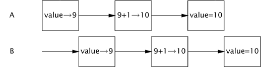

##StatelessFactorizer

`StatelessFactorizer` is, like most servlets, stateless: it has no fields and references no fields from other classes. The transient state for a particular computation exists solely in local variables that are stored on the thread's stack and are accessible only to the executing thread. 

One thread accessing a `StatelessFactorizer` cannot influence the result of another thread accessing the same `StatelessFactorizer`; because the two threads do not share state, it is as if they were accessing different instances. 

Since the actions of a thread accessing a stateless object cannot affect the correctness of operations in other threads, stateless objects are thread-safe.

***Stateless objects are always thread-safe.***

##UnsafeCountingFactorizer

`UnsafeCountingFactorizer` is not thread-safe, even though it would work just fine in a single-threaded environment.

While the increment operation, `++count`, may look like a single action because of its compact syntax, it is not atomic, which means that it does not execute as a single, indivisible operation. Instead, it is a shorthand for a sequence of three discrete operations: fetch the current value, add one to it, and write the new value back. This is an example of a read-modify-write operation, in which the resulting state is derived from the previous state.

If the counter is initially 9, with some unlucky timing each thread could read the value, see that it is 9, add one to it, and each set the counter to 10. This is clearly not what is supposed to happen; an increment got lost along the way, and the hit counter is now permanently off by one.

The possibility of incorrect results in the presence of unlucky timing is so important in concurrent programming that it has a name: a race condition.

**A race condition occurs when the correctness of a computation depends on the relative timing or interleaving of multiple threads by the runtime; in other words, when getting the right answer relies on lucky timing.**

##LazyInitRace
`LazyInitRace` has race conditions that can undermine its correctness. 

Say that threads A and B execute `getInstance` at the same time. A sees that instance is `null`, and instantiates a new `ExpensiveObject`. B also checks if instance is `null`. Whether instance is null at this point depends unpredictably on timing, including the vagaries of scheduling and how long A takes to instantiate the `ExpensiveObject` and set the instance field. If instance is `null` when B examines it, the two callers to `getInstance` may receive two different results, even though `getInstance` is always supposed to return the same instance.

##CountingFactorizer

Both `LazyInitRace` and `UnsafeCountingFactorizer` contained a sequence of operations that needed to be atomic, or indivisible, relative to other operations on the same state. To avoid race conditions, there must be a way to prevent other threads from using a variable while we're in the middle of modifying it, so we can ensure that other threads can observe or modify the state only before we start or after we finish, but not in the middle.

**Operations A and B** are atomic with respect to each other if, from the perspective of a thread executing A, when another thread executes B, either all of B has executed or none of it has. An atomic operation is one that is atomic with respect to all operations, including itself, that operate on the same state.